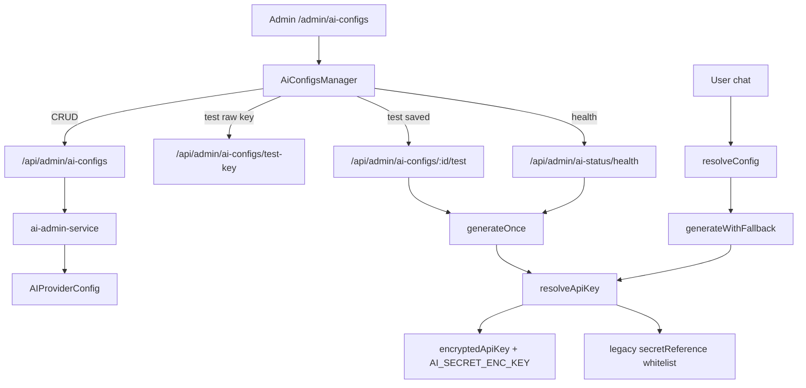
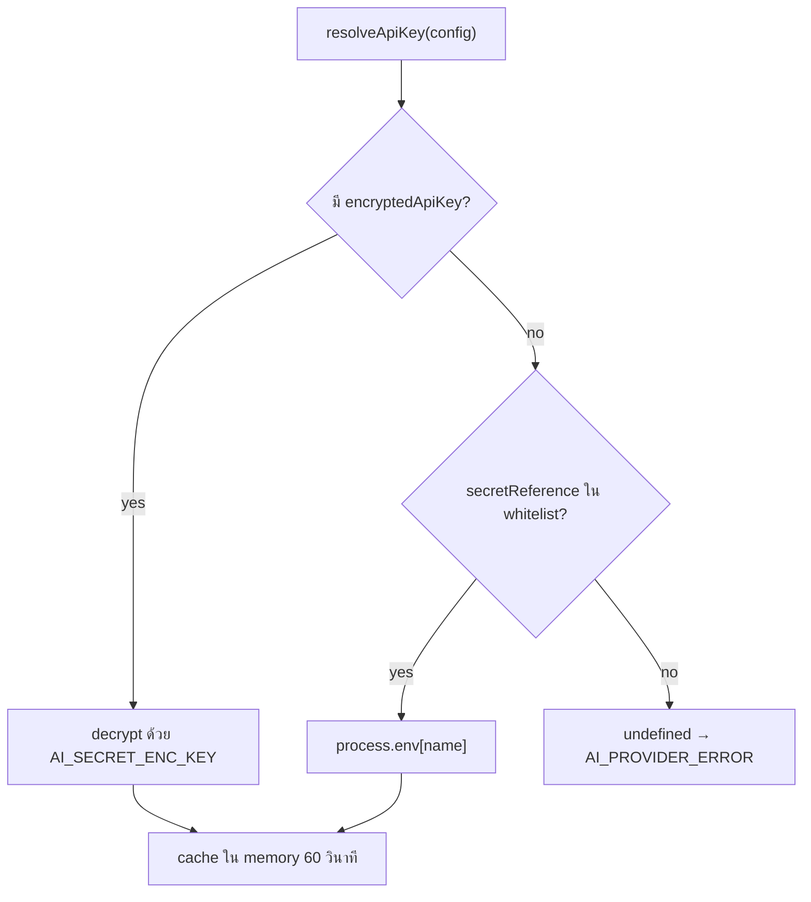
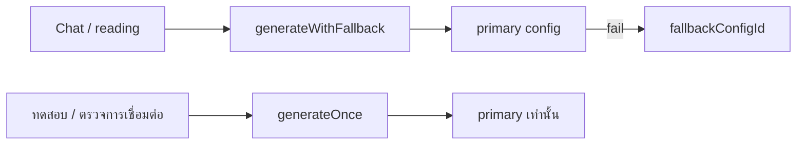

# SETTINGS_MODEL_AI — คู่มือหน้า Admin «โมเดล AI»

เอกสารนี้สรุปพฤติกรรมจริงของหน้า `/admin/ai-configs` ในโปรเจกต์ HoraSard  
ออกแบบให้เพื่อนหรือ AI อ่านแล้วเข้าใจทั้ง UI, ระบบ key, routing, health check และที่มาของ `AI_SECRET_ENC_KEY`

**อัปเดต:** 17 ก.ค. 2026  
**หน้าที่เกี่ยวข้อง:** Admin → โมเดล AI  
**URL:** `/admin/ai-configs`  
**เงื่อนไขเปิดใช้:** `FEATURES.aiAdmin === true` (ไม่ตั้ง `NEXT_PUBLIC_APP_PHASE=2`)

---

## 1. ภาพรวม

หน้านี้ให้แอดมินกำหนดว่า **แพลนไหน / หมวดไหน ใช้โมเดลอะไร** พร้อมวาง API key ของผู้ให้บริการ (Gemini หรือ OpenAI-compatible) โดยไม่ต้องแก้โค้ดหรือ redeploy

| ชั้น | ไฟล์หลัก | หน้าที่ |
|------|----------|---------|
| UI | `src/components/admin/ai-configs-manager.tsx` | ฟอร์ม + ตาราง + ปุ่มสถานะ |
| Page | `src/app/(admin)/admin/ai-configs/page.tsx` | เกตฟีเจอร์แล้วเรนเดอร์ UI |
| Service | `src/server/admin/ai-admin-service.ts` | CRUD + เข้ารหัส key + audit |
| Router | `src/server/ai/router.ts` | เลือก config + generate / fallback |
| Secrets | `src/server/ai/secret-resolver.ts` | ถอดรหัส key จาก DB หรือ env |
| Guards | `src/lib/ai-config-guards.ts` | whitelist env + ตรวจ Base URL |
| Crypto | `src/lib/crypto/secret-box.ts` | AES-256-GCM ด้วย `AI_SECRET_ENC_KEY` |



---

## 2. ที่มาที่ไปของระบบ API Key (สำคัญมาก)

### 2.1 ของเดิม (legacy)

เดิมออกแบบให้ **ไม่เก็บค่า key ใน DB**

- คอลัมน์ `secretReference` เก็บแค่ **ชื่อตัวแปร env** เช่น `GEMINI_API_KEY`
- ตอนเรียก AI ระบบอ่าน `process.env[secretReference]`
- แอดมินเปลี่ยน key = ไปแก้ไฟล์ `.env` / Vercel env แล้วรีสตาร์ท

ข้อดี: DB dump ไม่มี key  
ข้อเสีย: แอดมิน CMS เปลี่ยน key เองไม่ได้, ทุกโฮสต์ต้อง sync env, สับสนกับชื่อตัวแปรในฟอร์ม

### 2.2 ของใหม่ (ปัจจุบัน — เส้นทางหลัก)

แอดมิน **วาง API key ใน UI** → ระบบเข้ารหัสก่อนเก็บ

| ฟิลด์ใน DB | ความหมาย |
|------------|----------|
| `encryptedApiKey` | ciphertext AES-256-GCM (รูปแบบ `v1:iv:tag:cipher`) — **ไม่เคยส่งกลับให้ browser** |
| `keyLast4` | 4 ตัวท้ายของ key สำหรับโชว์ `••••xxxx` |
| `hasStoredKey` | ค่าที่ API สร้างให้ UI (มี ciphertext หรือไม่) |
| `secretReference` | **legacy เท่านั้น** — ชื่อ env ใน whitelist; config ใหม่ที่วาง key จะเคลียร์เป็น `null` |

### 2.3 `AI_SECRET_ENC_KEY` คืออะไร — ไม่ใช่ Gemini key

| ชื่อ | คืออะไร | วางในฟอร์มโมเดลไหม |
|------|---------|-------------------|
| `AI_SECRET_ENC_KEY` | **กุญแจเข้ารหัสของโฮสต์** (ล็อกตู้) — 32 bytes เป็น base64 หรือ hex 64 ตัว | **ห้าม** วางในช่อง API Key |
| `GEMINI_API_KEY` / `OPENAI_API_KEY` | key ของผู้ให้บริการ (ของในตู้) — legacy fallback | ไม่จำเป็นถ้าบันทึก key ใน UI แล้ว |
| ช่อง «API Key» ในฟอร์ม | key จริงของ Gemini / OpenAI / OpenRouter ฯลฯ | ใช่ — วางตรงนี้ |

**หลักการ:**  
- `AI_SECRET_ENC_KEY` ตั้งครั้งเดียวบนทุกเครื่องที่รันแอป (local `.env`, Vercel, staging)  
- แอดมินไม่ต้องแตะหลังติดตั้ง  
- ถ้าหมุน `AI_SECRET_ENC_KEY` ใหม่โดยไม่ re-save key ใน UI → decrypt พัง → แชทล้ม (ระบบ **ไม่** เด้งไปอ่าน `GEMINI_API_KEY` ให้เอง)

สร้างค่าตัวอย่าง (อย่า commit ค่าจริง):

```bash
node -e "console.log(require('crypto').randomBytes(32).toString('base64'))"
```

### 2.4 ลำดับการดึง key ตอนรันจริง (`resolveApiKey`)



Whitelist ที่อนุญาตเป็น `secretReference`: `GEMINI_API_KEY`, `OPENAI_API_KEY` เท่านั้น (`src/lib/ai-config-guards.ts`)

**ประโยชน์ของระบบใหม่**

1. แอดมินเปลี่ยน provider key จาก UI ได้โดยไม่แตะเซิร์ฟเวอร์  
2. Plaintext key ไม่ถูกเก็บใน DB และไม่ถูกส่งกลับใน GET list  
3. หลายโมเดลใช้ key คนละตัวได้ (แต่ละแถวมี ciphertext ของตัวเอง)  
4. Audit log ไม่เก็บ ciphertext  
5. Legacy env ยังเหลือเป็นทาง rollback ชั่วคราวเท่านั้น

---

## 3. ปุ่ม «+ เพิ่ม Model Config» / ฟอร์มเพิ่มโมเดล

### 3.1 กดแล้วเกิดอะไร

1. เปิดแผง **«เพิ่มโมเดลใหม่»** เหนือตาราง (ไม่ใช่แถวที่ 4 ในตาราง)  
2. ฟอร์มเริ่มจากค่าว่างสำหรับช่องที่แอดมินต้องพิมพ์เอง:
   - Model ID = ว่าง  
   - ชื่อที่แสดง = ว่าง  
   - Base URL = ว่าง (โชว์เฉพาะเมื่อเลือก OpenAI-compatible)  
   - API Key = ว่าง  
3. ค่าเริ่มต้นระบบที่ยังมี: โปรโตคอล = Gemini, เปิดใช้งาน = เปิด, แพลน = ทุกแพลน, หมวด = ทุกหมวด  
4. ปุ่ม **สร้าง config** จะกดได้เมื่อมี Model ID + ชื่อที่แสดง + API key (ตอนสร้าง)

หลังบันทึกสำเร็จ: ปิดฟอร์ม, โหลดรายการใหม่, **highlight + scroll** ไปแถวที่เพิ่งสร้าง (แถวใหม่อยู่ท้ายตารางเพราะเรียง `createdAt` เก่า→ใหม่)

### 3.2 ส่วน A · ตัวตนโมเดล

| ช่อง | ความหมาย | หมายเหตุ |
|------|----------|----------|
| **โปรโตคอล API** | วิธีเรียก API จริง | `Gemini` หรือ `OpenAI-compatible` — ไม่ใช่ชื่อโมเดล แต่คือ adapter ในโค้ด |
| **Base URL** | ที่อยู่เซิร์ฟเวอร์ของ OpenAI-compatible | โชว์เฉพาะ OpenAI-compatible; ว่าง = `https://api.openai.com/v1`; ใส่เมื่อใช้ OpenRouter/Groq/Cursor/self-host |
| **Model ID** | ชื่อโมเดลตามที่ provider กำหนด | ช่องพิมพ์เดียว ไม่มี preset dropdown |
| **ชื่อที่แสดง** | ชื่อที่แอดมินเห็นในตาราง/สถานะ | ไม่เกี่ยวกับชื่อที่ผู้ใช้เห็นในแชทโดยตรง |
| **เปิดใช้งาน** | ถ้าปิด จะไม่ถูกเลือกใน routing / ไม่เข้า health batch | |

**ทำไม Gemini ไม่มี Base URL**  
`GeminiAdapter` ยิงไป Google endpoint ตายตัว — ไม่รับ/ไม่ใช้ `baseUrl` จากแอดมิน (บันทึกก็ถูกเคลียร์เป็น `null`)

**ทำไมต้องเลือกโปรโตคอล**  
ระบบต้องรู้ว่าจะเรียก API แบบไหน: Google generateContent vs OpenAI `POST …/chat/completions`  
พิมพ์แค่ Model ID ไม่พอถ้าไม่รู้โปรโตคอล

**Base URL จำกัดความปลอดภัย**  
ต้องเป็น HTTPS, ไม่มี username/password/query/fragment, ต้องเป็น API root (ไม่ลงท้าย
`/models` หรือ `/chat/completions`) และห้าม localhost / private network
(`assertSafeOpenAiBaseUrl`) การเรียก provider ไม่ตาม redirect

**ตรวจ Model ID ก่อนบันทึก**

- กด **ดึงโมเดล** เพื่อเรียก `GET /models` ของ OpenAI-compatible หรือ Gemini Models API
- ระบบแสดงเฉพาะ Gemini models ที่รองรับ `generateContent`
- เลือกจากรายการได้ แต่ยังพิมพ์เองได้ เพราะบาง gateway ไม่รองรับ `GET /models`
- หลังเลือกแล้วกด **ทดสอบ key** เพื่อยิง generation จริง — ขั้นนี้เป็นคำตอบสุดท้ายว่า
  key + Base URL + Model ID ใช้งานร่วมกันได้จริง

### 3.3 ส่วน B · API Key

| การกระทำ | พฤติกรรม |
|----------|----------|
| วาง key | ส่งเป็น `apiKey` ตอน POST/PATCH — เข้ารหัสฝั่งเซิร์ฟเวอร์ก่อนเข้า DB |
| **ทดสอบ key** | `POST /api/admin/ai-configs/test-key` — ยิงจริงด้วย key ที่พิมพ์ **ไม่บันทึก** |
| **ดึงโมเดล** | endpoint เดียวกันพร้อม `action=discover` — อ่านรายการโดยไม่บันทึก key |
| สร้างโดยไม่มี key | ถูกปฏิเสธทั้งฝั่ง UI และ service |
| Legacy env | ซ่อนไว้; config ใหม่ที่วาง key จะตั้ง `secretReference = null` |

### 3.4 ส่วน C · ขอบเขตแพลน / หมวด

| ช่อง | ค่า | ผลต่อ routing |
|------|-----|----------------|
| ใช้กับแพลน | ALL / FREE / PRO | Free user จับคู่ FREE หรือ ALL; Pro จับคู่ PRO หรือ ALL |
| ใช้กับหมวด | ว่าง = ทุกหมวด หรือเลือกหมวดหนึ่ง | config ที่ผูกหมวดชนะ global |
| Prompt template | ว่าง = default ระบบ หรือเลือกบุคลิก | ใช้ประกอบ prompt (คู่กับหมวด) |

**หมายเหตุ:** ผูกโมเดลกับหมวดทำที่หน้านี้เท่านั้น — หน้า Categories **ไม่มี** ตัวเลือกโมเดลแล้ว (เคยเป็น dead knob `aiConfigId` ถูกลบ)

### 3.5 ส่วน D · พารามิเตอร์ขั้นสูง (พับเก็บ)

| ช่อง | ความหมาย |
|------|----------|
| **Fallback config** | ถ้าโมเดลนี้ล้มตอนแชท ให้ลอง config อื่นหนึ่งครั้ง |
| **Temperature** | 0–2 ความสุ่มของคำตอบ |
| **Max output tokens** | ความยาวคำตอบสูงสุดที่ส่งเข้า provider |
| **Timeout (ms)** | เวลารอสูงสุดต่อครั้ง (ค่าเริ่มต้น 30000) |
| **โน้ต** | ข้อความช่วยจำของแอดมิน |

---

## 4. Fallback ทำงานอย่างไรในระบบเรา

มีสองความหมายคนละชั้น — อย่าสับสน

### 4.1 Fallback ระหว่าง config (`fallbackConfigId`)

ใช้ตอน **ผู้ใช้แชทจริง** ผ่าน `generateWithFallback(configId)`:

1. ลอง primary  
2. ถ้าไม่ ok และมี `fallbackConfigId` ที่ยัง enabled → ลอง fallback อีกครั้ง  
3. การหักเครดิตเกิดหลัง AI สำเร็จใน reading-service — ชั้นนี้ไม่คิดเงิน

### 4.2 Health / ปุ่มทดสอบ **ไม่** ใช้ fallback

`generateOnce(configId)` ยิงเฉพาะ primary  
ดังนั้นแถวอาจขึ้นแดง (TIMEOUT / UNAVAILABLE / quota) ทั้งที่แชทผู้ใช้อาจรอดเพราะมี fallback ไป lite



---

## 5. ปุ่ม «รีเฟรช» และ «ตรวจการเชื่อมต่อ»

### 5.1 รีเฟรช

- เรียก `GET /api/admin/ai-status`  
- โหลด: Google Cloud incidents (ประกอบ Gemini), usage log 7 วัน, health cache ถ้ามี, provider alert  
- **ไม่** ยิง API ไปยังโมเดลใหม่

### 5.2 ตรวจการเชื่อมต่อ

- เรียก `POST /api/admin/ai-status/health` (force)  
- ยิงทุก config ที่ `enabled = true` แบบจำกัด concurrency  
- แต่ละครั้งใช้ prompt สั้น ๆ → **ใช้โควต้า/token จริงของ provider**  
- ผลขึ้นเป็น badge ในตาราง: `เชื่อมต่อได้ Xmss` หรือ `เชื่อมต่อไม่ได้ (ERROR_CODE)`  
- แถบบนหน้า: สรุป OK / ล้มเหลวรายชื่อ

ข้อความบน UI เน้นว่า: ยิง primary เท่านั้น ไม่ผ่าน fallback

### 5.3 ปุ่ม «ทดสอบ» รายแถว

- `POST /api/admin/ai-configs/:id/test` ด้วย timeout ยาวกว่า health เล็กน้อย  
- อัปเดต badge ของแถวนั้น  
- เช่นกัน: primary-only

### 5.4 ดึงรายชื่อโมเดล

- ตอนสร้าง/เปลี่ยน key: ใช้ raw key ที่อยู่ในฟอร์มและไม่บันทึก
- ตอนแก้ config เดิม: ใช้ encrypted key ที่บันทึกไว้ผ่าน route ของ config
- OpenAI-compatible บางเจ้าไม่มี `GET /models`; กรณีนี้ยังพิมพ์ Model ID เองแล้วใช้
  ปุ่มทดสอบ generation ได้
- รายการโมเดลเป็น advisory; ผล generation จริงเป็น authoritative validation

---

## 6. แก้ไข / ปิด / ลบ

### 6.1 แก้ไข

กด **แก้ไข** แล้ว:

1. เปิดแผงเดียวกัน หัวข้อเป็น `แก้ไข: {ชื่อ}`  
2. โหลดค่าเดิมทุกช่อง (รวม planScope, category, advanced)  
3. ช่อง API Key:
   - ถ้ามี stored key → โชว์ `••••{keyLast4}` + ปุ่ม **เปลี่ยน key**  
   - กดเปลี่ยน → ช่อง password + ทดสอบ key + ยกเลิกเปลี่ยน  
4. Legacy env fallback: ซ่อน; กดขยายได้ถ้าแถวยังมี `secretReference`  
5. บันทึก = `PATCH /api/admin/ai-configs/:id`  
6. ถ้าส่ง `apiKey` ใหม่ → เข้ารหัสใหม่และ **เคลียร์ `secretReference`**

### 6.2 ปิด / เปิด

สลับ `enabled` ด้วย PATCH — config ที่ปิดไม่เข้า `resolveConfig` และไม่เข้า health batch

### 6.3 ลบ

- `DELETE /api/admin/ai-configs/:id`  
- ถ้า config นี้ถูกชี้เป็น `fallbackConfigId` ของแถวอื่น → ลบไม่ได้ ต้องปิดแทน  
- (เดิมเคยบล็อกเมื่อหมวดอ้าง `aiConfigId` — คอลัมน์นั้นถูกลบแล้ว)

---

## 7. Routing ตอนผู้ใช้แชท (`resolveConfig`)

เมื่อมีคำถามดูดวง ระบบเลือกแถว `AIProviderConfig` ดังนี้:

1. เอาเฉพาะ `enabled = true`  
2. หมวดตรงกัน หรือ `categoryId = null` (ทุกหมวด)  
3. `planScope` เป็นแพลนของผู้ใช้ (FREE/PRO) หรือ ALL  
4. คะแนน: หมวดตรง +2, แพลนตรง +1  
5. Tie-break: `updatedAt` ใหม่กว่า → `id` น้อยกว่า  
6. Brief mode (`preferFast`): ในกลุ่มที่มีสิทธิ์ ชอบ `modelId` ที่มีคำว่า `lite`

จากนั้น generate ด้วย `generateWithFallback` ของ config ที่ชนะ

---

## 8. Seed / สถานะข้อมูลเริ่มต้น (อ้างอิง)

หลัง migrate keys (`scripts/migrate-ai-config-keys.ts`) seed ทั่วไปมีลักษณะ:

| id | บทบาท | planScope | หมายเหตุ |
|----|--------|-----------|----------|
| `seed-gemini-default` | fallback ทุกแพลน | ALL | มักเป็น lite |
| `seed-gemini-free` | Free | FREE | fallback → default |
| `seed-gemini-pro` | Pro | PRO | fallback → default |

ตอนนี้ key เก็บแบบ encrypted ใน DB (`hasStoredKey`) ไม่พึ่ง `secretReference=GEMINI_API_KEY` เป็นหลักแล้ว

**GPT / OpenAI-compatible:** มีแค่ในโค้ดเป็นแนวทาง — **ไม่มีแถวใน DB** จนกว่าแอดมินจะสร้างเองจากฟอร์มนี้

---

## 9. Troubleshooting ที่เจอบ่อย

| อาการ | สาเหตุจริง | ทำอย่างไร |
|--------|------------|-----------|
| ใส่ทั้ง `AI_SECRET_ENC_KEY` และ `GEMINI_API_KEY` ในฟอร์มแล้วยังพัง | สับสนบทบาท — `AI_SECRET_ENC_KEY` ไม่ใช่ Gemini key | วาง **Gemini API key** ในช่อง API Key เท่านั้น; `AI_SECRET_ENC_KEY` อยู่แค่ใน `.env` |
| Lite เขียว แต่ `gemini-3.5-flash` แดง TIMEOUT | โมเดลช้า / health timeout | เพิ่ม Timeout ในขั้นสูง หรือรอ / ใช้ lite ชั่วคราว |
| UNAVAILABLE + high demand | Google โหลดหนักชั่วคราว | รอแล้วทดสอบใหม่ — key ถูกแล้ว |
| Quota exceeded free_tier limit 20 | กดทดสอบ/health บ่อยเกินเพดานฟรีของ Google | รอตามที่ข้อความบอก (เช่น ~50s) หรืออัปเกรด billing ที่ AI Studio |
| สร้างโมเดลแล้วหาไม่เจอ | อยู่ท้ายตาราง | scroll ลง / ดู highlight หลังบันทึก |
| หมวดตั้งโมเดลแล้วไม่เปลี่ยน | ตัวเลือกบน Categories ถูกลบแล้ว | ตั้งที่ AI Config → ใช้กับหมวด |
| Chat 500 หลังหมุน enc key | decrypt พัง ไม่ fallback env | คืน `AI_SECRET_ENC_KEY` เดิม หรือวาง key ใหม่ในทุกแถว |

เอกสาร ops เพิ่ม: `docs/ops_gemini_billing_alerts.md`

---

## 10. API ที่เกี่ยวข้อง (สำหรับนักพัฒนา)

| Method | Path | ใช้เมื่อ |
|--------|------|---------|
| GET | `/api/admin/ai-configs` | โหลดตาราง |
| POST | `/api/admin/ai-configs` | สร้าง (ต้องมี `apiKey`) |
| PATCH | `/api/admin/ai-configs/:id` | แก้ไข |
| DELETE | `/api/admin/ai-configs/:id` | ลบ |
| POST | `/api/admin/ai-configs/test-key` | ทดสอบ key หรือดึง models ด้วย raw key ก่อนบันทึก |
| POST | `/api/admin/ai-configs/:id/test` | ทดสอบ config หรือดึง models ด้วย key ที่บันทึกแล้ว |
| GET | `/api/admin/ai-status` | รีเฟรชแผงสถานะ |
| POST | `/api/admin/ai-status/health` | ตรวจการเชื่อมต่อทุกตัวที่เปิด |

ทั้งหมดต้องผ่าน `requireAdmin()` + `assertAiAdminEnabled()`

---

## 11. แผนที่ไฟล์ / เอกสารอื่น

| ไฟล์ | บทบาท |
|------|--------|
| `src/components/admin/ai-configs-manager.tsx` | UI ทั้งหน้า |
| `src/server/admin/ai-admin-service.ts` | CRUD + encrypt |
| `src/server/admin/ai-status-service.ts` | status + health batch |
| `src/server/ai/router.ts` | resolveConfig, generateOnce, generateWithFallback |
| `src/server/ai/secret-resolver.ts` | ดึง plaintext key |
| `src/server/ai/providers/gemini.ts` | Gemini adapter |
| `src/server/ai/providers/openai.ts` | OpenAI-compatible + baseUrl |
| `src/lib/ai-config-guards.ts` | Base URL + env whitelist |
| `src/lib/admin-schemas.ts` | Zod create/update/test-key |
| `prisma/schema.prisma` → `AIProviderConfig` | สคีมา |
| `scripts/migrate-ai-config-keys.ts` | one-time migrate seed → encrypted |
| `tests/ai-config-guards.test.ts` | regression guards |
| `tests/router-fallback.test.ts` | routing + once vs fallback |
| `docs/backend_ai_admin.md` | สถานะโมดูล backend |
| `docs/admin_cms_ux.md` | สถานะ UX admin |
| `docs/index.md` | สารบัญกลาง |

---

## 12. สรุปสั้นสำหรับส่งต่อเพื่อน / AI

1. หน้า `/admin/ai-configs` คือศูนย์ควบคุมโมเดล + key  
2. **สร้างโมเดล**: ดึงรายการจาก provider แล้วเลือก หรือพิมพ์ Model ID เอง จากนั้นทดสอบ generation จริง
3. **`AI_SECRET_ENC_KEY` = กุญแจเข้ารหัสโฮสต์** ไม่ใช่ Gemini key และห้ามวางในฟอร์ม  
4. Runtime อ่าน key จาก DB (ถอดรหัส) เป็นหลัก; env เป็น legacy  
5. แชทใช้ fallback config ได้; ปุ่มทดสอบ/health ยิง primary ตรง ๆ เพื่อไม่หลอกเขียว  
6. Error แบบ UNAVAILABLE / free-tier quota มาจาก Google ไม่ใช่ระบบใส่ key ผิด  
7. ผูกหมวด/แพลนที่ฟอร์มนี้ — ไม่ใช่หน้า Categories  

---

## 13. ผลตรวจและข้อเสนอแนะ

### ทำแล้ว

- Admin เพิ่ม Gemini และ OpenAI-compatible provider config ได้
- กรอก Base URL, key, Model ID และทดสอบก่อนบันทึกได้
- ดึงรายชื่อ model IDs ที่ key เข้าถึงได้จาก provider
- ทดสอบ config ที่บันทึกแล้วแบบ primary-only
- API key เข้ารหัสก่อนเก็บและไม่ส่ง plaintext/ciphertext กลับ browser
- เปลี่ยน Provider แล้วต้องวาง key ใหม่ ป้องกันเอา Gemini key ไปใช้กับ OpenAI หรือกลับกัน
- PATCH ฟิลด์อื่นไม่ล้าง custom Base URL โดยไม่ตั้งใจ
- Custom OpenAI-compatible endpoint ใช้ `max_tokens`; OpenAI ทางการใช้
  `max_completion_tokens`
- Base URL ปฏิเสธ completion-level path, query, fragment, private literal IP และ redirect

### ข้อจำกัดที่ตั้งใจไว้

- `provider` ยังรองรับสอง protocol families: Gemini และ OpenAI-compatible เท่านั้น
  ชื่อบริการอื่นใช้ได้เมื่อ API เข้ากันกับ OpenAI Chat Completions จริง
- การดึง models เป็น advisory เพราะบาง gateway ไม่ทำ `GET /models`; ปุ่ม generation test
  เป็นตัวตรวจที่เชื่อถือได้กว่า
- OpenAI-compatible ยังตอบแบบ one-shot ใน chat ไม่ได้ stream token ทีละส่วนเหมือน Gemini
- การกัน SSRF ตรวจ private IP/hostname ที่เห็นใน URL แล้ว แต่ยังควรเพิ่ม DNS-resolution
  enforcement ที่ network/egress layer สำหรับ production ที่เปิดรับ Base URL จากผู้ดูแล
- โมเดลที่ไม่อยู่ใน pricing catalog จะประเมินต้นทุนได้ไม่แม่น ต้องเพิ่มราคาใน
  `src/config/ai-pricing.ts` ก่อนใช้รายงานค่าใช้จ่ายจริง

จบคู่มือ
